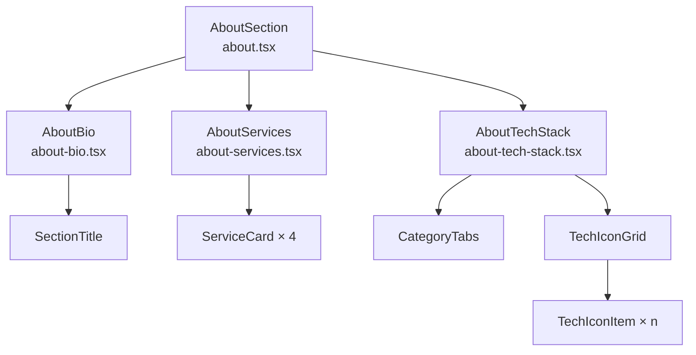
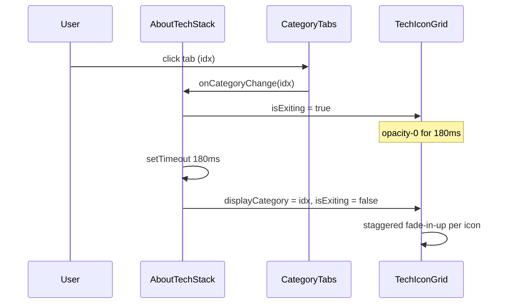
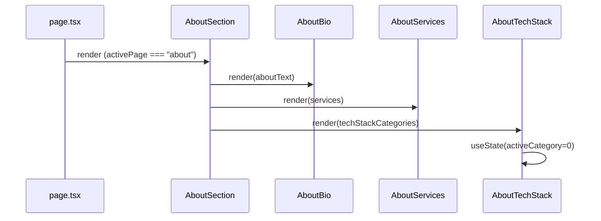

# Design Document: About Me Section Refactor

## Overview

Refactor the `AboutSection` component (`src/components/sections/about.tsx`) to improve visual hierarchy, breathing room, and polish — without touching the Sidebar, Navigation, or any other section. The refactor decomposes the monolithic component into focused sub-components, restructures the bio into scannable chunks, elevates the service cards with a richer layout, and keeps the animated tech stack grid while tightening its visual presentation.

The stack remains Next.js 15 + TypeScript + Tailwind CSS v4 + shadcn/ui + Lucide icons + `tech-stack-icons`. No new dependencies are introduced.

---

## Architecture

The current `AboutSection` is a single 100-line component that owns all state and markup. The refactor extracts three focused sub-components while keeping `AboutSection` as the orchestrating shell.



All sub-components live in `src/components/sections/` alongside `about.tsx`. They are not exported from the barrel — only `AboutSection` is consumed by `page.tsx`.

---

## Sequence Diagrams

### Category Tab Switch Flow



### Page Render Flow



---

## Components and Interfaces

### Component: `AboutSection`

**Purpose**: Orchestrating shell. Owns no state — delegates everything to sub-components.

**Interface**:
```typescript
// No props — reads data directly from @/lib/data
export function AboutSection(): JSX.Element
```

**Responsibilities**:
- Render `SectionTitle` ("About me")
- Render `AboutBio`, `AboutServices`, `AboutTechStack` in vertical stack
- Apply consistent `space-y-10` gap between sub-sections

---

### Component: `AboutBio`

**Purpose**: Renders the bio text with improved scanability — splits the second long paragraph into bullet highlights.

**Interface**:
```typescript
interface AboutBioProps {
  paragraphs: string[]  // from aboutText in data.ts
}

export function AboutBio({ paragraphs }: AboutBioProps): JSX.Element
```

**Responsibilities**:
- Render first paragraph as a lead paragraph (slightly larger, foreground color)
- Render second paragraph as prose with a set of extracted highlight pills below it
- Highlight pills surface key specialisms: "Flutter & Native iOS/Android", "Clean Architecture", "RAG & LLM Systems", "CI/CD Pipelines", "Mentoring"
- Pills use `bg-muted text-muted-foreground` with `rounded-full px-3 py-1 text-xs font-medium`

---

### Component: `AboutServices`

**Purpose**: Renders the four service cards in a richer, more spacious layout.

**Interface**:
```typescript
interface Service {
  icon: string       // path to SVG in /public/images/
  title: string
  description: string
}

interface AboutServicesProps {
  services: Service[]
}

export function AboutServices({ services }: AboutServicesProps): JSX.Element
```

**Responsibilities**:
- Render section sub-heading "What I'm Doing"
- Render a 2-column responsive grid of `ServiceCard` components
- Each card uses a larger icon container (48×48 → 56×56), a gradient accent strip on the left border, and more generous padding

---

### Component: `ServiceCard` (internal to `AboutServices`)

**Purpose**: Individual service card with elevated visual treatment.

**Interface**:
```typescript
interface ServiceCardProps {
  service: Service
  index: number   // used for staggered entrance animation delay
}
```

**Visual structure**:
```
┌─────────────────────────────────────┐
│ ░░ [Icon 56×56]  Title              │  ← left accent border (2px, primary/30)
│                  Description text   │
└─────────────────────────────────────┘
```

**Responsibilities**:
- Left border accent: `border-l-2 border-l-primary/30 hover:border-l-primary/70`
- Icon container: `h-14 w-14 rounded-2xl bg-muted/80`
- Entrance animation: `animate-in fade-in slide-in-from-bottom-4` with `animationDelay: index * 80ms`

---

### Component: `AboutTechStack`

**Purpose**: Owns category-switch state and renders the tab + icon grid.

**Interface**:
```typescript
interface AboutTechStackProps {
  categories: TechStackCategory[]
}

interface TechStackCategory {
  label: string
  emoji: string
  techs: { icon: string; name: string }[]
}

export function AboutTechStack({ categories }: AboutTechStackProps): JSX.Element
```

**Responsibilities**:
- Own `activeCategory`, `displayCategory`, `isExiting`, `gridKey` state (identical logic to current)
- Render `CategoryTabs` and `TechIconGrid` as internal sub-elements
- Apply `space-y-5` between tabs and grid

---

## Data Models

### `Service` (from `src/lib/data.ts`)

```typescript
type Service = {
  icon: string        // "/images/icon-app.svg" etc.
  title: string       // "Mobile Development" etc.
  description: string // prose description
}
```

**Validation Rules**:
- `icon` must be a non-empty string (path to existing public asset)
- `title` must be non-empty
- `description` must be non-empty

### `TechStackCategory` (from `src/lib/data.ts`)

```typescript
type TechStackCategory = {
  label: string
  emoji: string
  techs: Array<{ icon: string; name: string }>
}
```

**Validation Rules**:
- `techs` array must be non-empty
- Each `tech.icon` must be a valid `StackIcon` name

### `BioHighlight` (new, local to `AboutBio`)

```typescript
type BioHighlight = {
  label: string   // display text for the pill
}

const BIO_HIGHLIGHTS: BioHighlight[] = [
  { label: "Flutter & Native iOS/Android" },
  { label: "Clean Architecture" },
  { label: "RAG & LLM Systems" },
  { label: "CI/CD Pipelines" },
  { label: "Mentoring" },
]
```

---

## Layout & Spacing System

### Vertical Rhythm

| Gap | Usage |
|-----|-------|
| `space-y-10` | Between major sub-sections (Bio → Services → TechStack) |
| `space-y-4` | Between sub-heading and its content |
| `space-y-3` | Between bio paragraphs |
| `gap-4` | Between service cards in grid |
| `gap-3` | Between tech icon items |

### Responsive Breakpoints

| Breakpoint | Behavior |
|------------|----------|
| `< sm` (< 640px) | Service cards: 1 column; bio pills: wrap freely |
| `sm` (≥ 640px) | Service cards: 2 columns |
| `md` (≥ 768px) | No structural change (section is inside a card, not full-width) |

### Color Usage

| Token | Usage |
|-------|-------|
| `text-foreground` | Lead bio paragraph, card titles, section sub-headings |
| `text-muted-foreground` | Secondary bio paragraph, card descriptions, tech labels |
| `bg-muted` | Icon containers, category tab backgrounds (inactive) |
| `bg-muted/60` | Tech icon item backgrounds |
| `bg-primary` | Active category tab background |
| `text-primary-foreground` | Active category tab text |
| `border-l-primary/30` → `border-l-primary/70` | Service card left accent (rest → hover) |
| `bg-card` | Card backgrounds (via shadcn `Card`) |

---

## Algorithmic Pseudocode

### Category Switch Algorithm

```pascal
PROCEDURE handleCategoryChange(idx: number)
  INPUT: idx — index of the newly selected category
  OUTPUT: side-effects on state

  PRECONDITION: idx ∈ [0, categories.length - 1]
  PRECONDITION: isExiting = false (guard prevents double-trigger)

  BEGIN
    IF idx = activeCategory OR isExiting THEN
      RETURN  // no-op
    END IF

    SET isExiting ← true

    SCHEDULE after 180ms:
      SET displayCategory ← idx
      SET activeCategory  ← idx
      SET gridKey         ← gridKey + 1   // forces React key remount → re-triggers stagger
      SET isExiting       ← false
    END SCHEDULE
  END

  POSTCONDITION: after 180ms, displayCategory = idx AND isExiting = false
  LOOP INVARIANT: N/A (no loops)
END PROCEDURE
```

### Tech Icon Stagger Animation

```pascal
PROCEDURE renderTechIcons(techs: Tech[], isExiting: boolean, gridKey: number)
  INPUT: techs — array of tech items for current category
  OUTPUT: rendered icon grid with staggered entrance

  BEGIN
    FOR i ← 0 TO techs.length - 1 DO
      INVARIANT: all icons at index < i have been assigned their animation delay

      delay ← i * 45ms

      RENDER TechIconItem(
        tech    = techs[i],
        delay   = delay,
        opacity = IF isExiting THEN 0 ELSE 1
      )
    END FOR
  END

  POSTCONDITION: each icon has animationDelay = index * 45ms
  POSTCONDITION: grid opacity = 0 during exit transition, 1 otherwise
END PROCEDURE
```

---

## Key Functions with Formal Specifications

### `AboutBio` render

```typescript
function AboutBio({ paragraphs }: AboutBioProps): JSX.Element
```

**Preconditions:**
- `paragraphs` is a non-empty array of non-empty strings
- `paragraphs[0]` is the lead paragraph (shorter, introductory)
- `paragraphs[1]` is the detail paragraph (longer)

**Postconditions:**
- First paragraph rendered with `text-sm leading-relaxed text-foreground font-medium`
- Remaining paragraphs rendered with `text-sm leading-relaxed text-muted-foreground`
- `BIO_HIGHLIGHTS` pills rendered below paragraphs as a `flex flex-wrap gap-2` row
- No mutations to `paragraphs` input

**Loop Invariants:**
- For the paragraph map: all previously rendered paragraphs retain their assigned style class

---

### `ServiceCard` render

```typescript
function ServiceCard({ service, index }: ServiceCardProps): JSX.Element
```

**Preconditions:**
- `service.icon`, `service.title`, `service.description` are all non-empty strings
- `index` is a non-negative integer

**Postconditions:**
- Card renders with `border-l-2 border-l-primary/30` left accent
- Icon `Image` renders at `width={28} height={28}` inside a `h-14 w-14` container
- Entrance animation delay = `index * 80`ms
- Hover state transitions `border-l-primary/30` → `border-l-primary/70` and applies `shadow-md`

---

### `handleCategoryChange`

```typescript
function handleCategoryChange(idx: number): void
```

**Preconditions:**
- `idx` is a valid index into `techStackCategories`
- Component is mounted

**Postconditions:**
- If `idx === activeCategory` or `isExiting === true`: no state change
- Otherwise: after 180ms, `activeCategory === idx`, `displayCategory === idx`, `isExiting === false`
- `gridKey` is incremented exactly once per successful category change

---

## Example Usage

```typescript
// page.tsx — unchanged, AboutSection is a drop-in replacement
import { AboutSection } from "@/components/sections/about"

// about.tsx — new orchestrating shell
import { aboutText, services, techStackCategories } from "@/lib/data"
import { AboutBio } from "./about-bio"
import { AboutServices } from "./about-services"
import { AboutTechStack } from "./about-tech-stack"

export function AboutSection() {
  return (
    <div className="space-y-10">
      <SectionTitle>About me</SectionTitle>
      <AboutBio paragraphs={aboutText} />
      <AboutServices services={services} />
      <AboutTechStack categories={techStackCategories} />
    </div>
  )
}

// about-bio.tsx — bio with highlight pills
export function AboutBio({ paragraphs }: AboutBioProps) {
  return (
    <div className="space-y-3">
      <p className="text-sm leading-relaxed text-foreground font-medium">
        {paragraphs[0]}
      </p>
      {paragraphs.slice(1).map((text, i) => (
        <p key={i} className="text-sm leading-relaxed text-muted-foreground">
          {text}
        </p>
      ))}
      <div className="flex flex-wrap gap-2 pt-1">
        {BIO_HIGHLIGHTS.map((h) => (
          <span key={h.label} className="rounded-full bg-muted px-3 py-1 text-xs font-medium text-muted-foreground">
            {h.label}
          </span>
        ))}
      </div>
    </div>
  )
}

// about-services.tsx — service cards with left accent border
function ServiceCard({ service, index }: ServiceCardProps) {
  return (
    <Card
      className="border border-l-2 border-l-primary/30 shadow-sm transition-all duration-200 hover:border-l-primary/70 hover:shadow-md"
      style={{ animationDelay: `${index * 80}ms`, animationFillMode: "both" }}
    >
      <CardContent className="flex gap-4 p-5">
        <div className="flex h-14 w-14 shrink-0 items-center justify-center rounded-2xl bg-muted/80">
          <Image src={service.icon} alt={service.title} width={28} height={28} />
        </div>
        <div>
          <h4 className="text-sm font-semibold">{service.title}</h4>
          <p className="mt-1 text-xs leading-relaxed text-muted-foreground">
            {service.description}
          </p>
        </div>
      </CardContent>
    </Card>
  )
}
```

---

## Correctness Properties

### Property 1: Bio completeness
For all `paragraphs` arrays passed to `AboutBio`, every element is rendered exactly once in document order. No paragraph is skipped or duplicated.

**Validates: Requirements 2.1**

### Property 2: Service card count
For all `services` arrays of length `n`, the rendered grid contains exactly `n` cards — one per service item.

**Validates: Requirements 3.1**

### Property 3: Active tab invariant
At any point in time, exactly one category tab has the `bg-primary text-primary-foreground` style applied. No two tabs are simultaneously active.

**Validates: Requirements 4.2**

### Property 4: Grid key monotonicity
After each successful `handleCategoryChange`, `gridKey` is strictly greater than its previous value, ensuring React remounts the icon grid and resets stagger animations.

**Validates: Requirements 4.3, 4.8**

### Property 5: Animation delay monotonicity
For any rendered tech icon grid, `animationDelay[i] < animationDelay[i+1]` for all valid `i` — icons stagger in order.

**Validates: Requirements 4.7**

### Property 6: Exit guard idempotency
`handleCategoryChange` called with the current `activeCategory` produces no state transitions. The function is a no-op when `idx === activeCategory` or `isExiting === true`.

**Validates: Requirements 4.4, 4.5**

### Property 7: No data mutation
Neither `AboutBio`, `AboutServices`, nor `AboutTechStack` mutate their input props. All rendering is purely derived from props.

**Validates: Requirements 2.6, 3.9, 4.11**

---

## Error Handling

### Missing Icon Asset

**Condition**: `service.icon` path does not resolve to a valid image in `/public`.
**Response**: Next.js `Image` component renders a broken image placeholder; no JS error thrown.
**Recovery**: Add a fallback `onError` handler on the `Image` to swap to a generic icon SVG (e.g., `icon-dev.svg`).

### Invalid `StackIcon` Name

**Condition**: `tech.icon` is not a recognized name in `tech-stack-icons`.
**Response**: `StackIcon` renders an empty/blank SVG — no crash.
**Recovery**: Validate icon names against the library's exported list at build time (optional lint rule).

### Empty `techStackCategories`

**Condition**: `techStackCategories` array is empty.
**Response**: `AboutTechStack` renders the sub-heading with no tabs and no grid — graceful empty state.
**Recovery**: Guard with `if (categories.length === 0) return null` in `AboutTechStack`.

---

## Testing Strategy

### Unit Testing Approach

Test each sub-component in isolation using React Testing Library:

- `AboutBio`: assert all paragraphs render, assert highlight pills render with correct labels
- `ServiceCard`: assert icon, title, description render; assert correct `animationDelay` style
- `AboutTechStack`: assert initial category is index 0; assert tab click triggers state transition after 180ms (use `jest.useFakeTimers`)

### Property-Based Testing Approach

**Property Test Library**: `fast-check`

Key properties to test:
- For any non-empty `paragraphs` array, `AboutBio` renders exactly `paragraphs.length` `<p>` elements
- For any `services` array of length `n`, `AboutServices` renders exactly `n` cards
- For any valid `idx` in `[0, categories.length - 1]`, calling `handleCategoryChange(idx)` twice in a row results in the same final state as calling it once

### Integration Testing Approach

- Render `AboutSection` with real data from `src/lib/data.ts` and assert the full section tree renders without errors
- Simulate tab clicks and assert the correct tech icons appear after the 180ms transition

---

## Performance Considerations

- Sub-component extraction does not add render overhead — React reconciles them as before.
- `gridKey` remount strategy is intentional: it resets CSS `animation-delay` stagger. The cost is remounting ~10 DOM nodes, which is negligible.
- `StackIcon` renders inline SVGs; no network requests. The icon grid is already performant.
- `Image` components for service icons use Next.js optimization with fixed `width`/`height` — no layout shift.
- Highlight pills are static (no state, no effects) — zero runtime cost.

---

## Security Considerations

- All data (`aboutText`, `services`, `techStackCategories`) is static and defined at build time in `src/lib/data.ts` — no user input, no XSS surface.
- `service.icon` paths are hardcoded strings pointing to `/public/images/` — no dynamic path construction from user input.
- Social links in the Sidebar (out of scope) already use `href` attributes; no `dangerouslySetInnerHTML` is used anywhere in this refactor.

---

## Dependencies

| Dependency | Version | Usage |
|------------|---------|-------|
| `next` | 15.x | `Image` component, App Router |
| `react` | 19.x | Component model, hooks (`useState`) |
| `tailwindcss` | 4.x | All styling via utility classes |
| `shadcn/ui` | latest | `Card`, `CardContent` components |
| `tech-stack-icons` | latest | `StackIcon` for tech grid |
| `lucide-react` | latest | (available, not used in About section) |

No new dependencies are introduced by this refactor.
